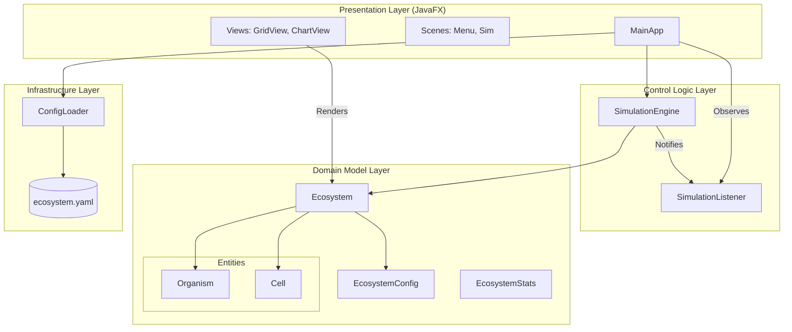
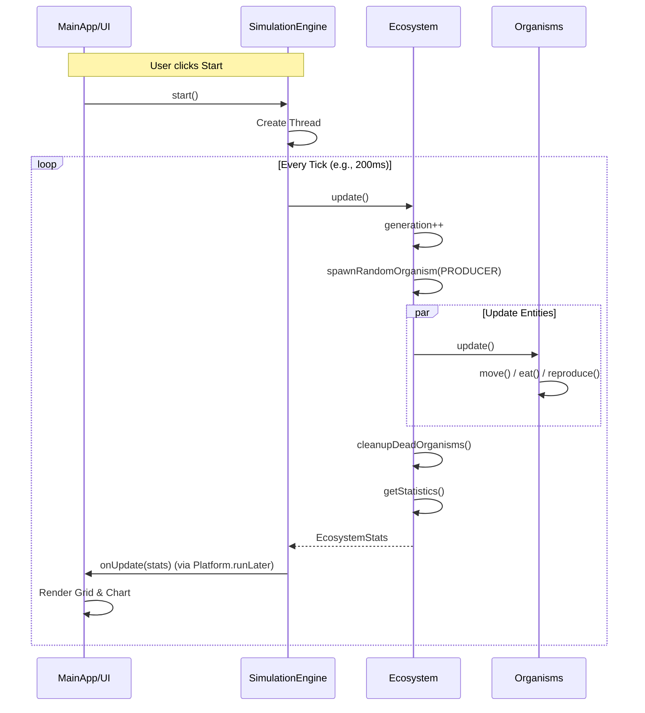

# DETAILED PROJECT ANALYSIS: Ecosystem Food Chain Simulation

## 1. Thông Tin Cơ Bản (Basic Information)
- **Tên dự án (Project name)**: Ecosystem Food Chain Simulation
- **Mục đích (Purpose)**: Mô phỏng sự tương tác phức tạp giữa các loài trong chuỗi thức ăn (Producer, Herbivore, Carnivore) trong một môi trường lưới 2D, minh họa các khái niệm sinh thái học như cân bằng năng lượng và động lực học quần thể.
- **Tech Stack**: Java 17+, JavaFX 21, Maven, SnakeYAML.
- **Ngôn ngữ chính (Main language)**: Java.
- **Loại dự án (Project type)**: Simulation / Educational Tool.

## 2. Vấn Đề Giải Quyết (Problems Solved)
1.  **Trực quan hóa Động lực học Quần thể**: Giúp người dùng hình dung cách số lượng các loài biến động theo thời gian và tác động lẫn nhau (ví dụ: quá nhiều động vật ăn cỏ sẽ làm cạn kiệt nguồn thức ăn).
2.  **Mô phỏng Hệ thống Phức tạp**: Giải quyết bài toán quản lý trạng thái của hàng trăm/ngàn thực thể độc lập tương tác trên một không gian chung thời gian thực.
3.  **Cân bằng Năng lượng**: Minh họa quy tắc truyền năng lượng trong tự nhiên (chỉ một phần năng lượng được chuyển lên cấp dinh dưỡng cao hơn).

## 3. Giải Pháp Đề Xuất (Proposed Solution)
Dự án sử dụng mô hình **Agent-based Simulation** kết hợp với **Game Loop pattern**:
- **Grid System**: Môi trường 2D nơi các sinh vật tồn tại và di chuyển.
- **OOP Hierarchy**: Sử dụng đa hình để định nghĩa hành vi riêng biệt cho từng loài (Producer quang hợp, Carnivore săn mồi).
- **Multithreading**: Tách biệt logic mô phỏng (Simulation Thread) và giao diện (JavaFX Application Thread) để đảm bảo hiệu năng và độ mượt mà.

---

## 4. Kiến Trúc Tổng Thể (Overall Architecture)

### 4.1. Biểu Đồ Kiến Trúc Tổng Quan (Overall Architecture Diagram)



### 4.2. Các Thành Phần Chính (Main Components)

#### 4.2.1. Presentation Layer (com.ecosystem.ui)
- **Mô tả**: Xử lý hiển thị giao diện người dùng và tương tác.
- **Công nghệ**: JavaFX.
- **Chức năng chính**:
  - `MainApp`: Entry point, quản lý chuyển đổi giữa Menu và Simulation Scene.
  - `GridView`: Render trạng thái các ô (Cell) và sinh vật lên màn hình canvas.
  - `ChartView`: Vẽ biểu đồ biến động dân số theo thời gian thực (LineChart).

#### 4.2.2. Control Logic Layer (com.ecosystem.simulation)
- **Mô tả**: Điều phối vòng lặp mô phỏng và trạng thái ứng dụng.
- **Modules chính**:
  - `SimulationEngine`: Chạy trên thread riêng, thực hiện game loop (update -> notify -> sleep).
  - `SimulationListener`: Interface Observer để tách biệt Engine và UI.

#### 4.2.3. Domain Model Layer (com.ecosystem.model)
- **Mô tả**: Chứa core business logic và trạng thái của hệ thống.
- **Thành phần**:
  - `Ecosystem`: Container quản lý lưới (Grid) và danh sách sinh vật.
  - `Organism` (Abstract): Class cha định nghĩa các thuộc tính cơ bản (năng lượng, vị trí).
  - `Producer`, `Herbivore`, `Carnivore`: Các thực thể cụ thể với hành vi riêng.

---

## 5. Luồng Hoạt Động Tổng Thể (Overall Workflow)

### 5.1. Biểu Đồ Sequence Game Loop (Simulation Loop Sequence)



### 5.2. Mô Tả Chi Tiết Vòng Lặp

1.  **Update Phase**: 
    - Engine gọi `ecosystem.update()`.
    - Hệ thống random thêm Producer mới (mô phỏng mọc cây tự nhiên).
    - Duyệt qua danh sách sinh vật (đã được shuffle để công bằng), gọi hàm `update()` của từng cá thể.
2.  **Entity Action**:
    - **Producer**: Tăng năng lượng (quang hợp). Nếu đủ năng lượng -> Sinh sản.
    - **Herbivore/Carnivore**: Giảm năng lượng (đói). Di chuyển tìm thức ăn. Nếu ăn được -> Tăng năng lượng. Nếu đủ năng lượng -> Sinh sản.
3.  **Cleanup Phase**:
    - Loại bỏ các sinh vật đã chết (hết năng lượng hoặc bị ăn) khỏi Grid và danh sách quản lý.
4.  **Notification Phase**:
    - Engine tính toán thống kê (số lượng, tổng năng lượng).
    - Gửi event `onUpdate` cho UI Listener.
    - UI sử dụng `Platform.runLater` để cập nhật đồ họa an toàn (thread-safe).

---

## 6. Phân Tích Các Module Chính (Main Module Analysis)

### 6.1. Module: Simulation Engine (com.ecosystem.simulation)

#### 6.1.1. Mục Đích
Quản lý vòng đời của simulation (Start, Pause, Stop, Reset) và duy trì nhịp tim (tick) của hệ thống.

#### 6.1.2. Các Class Chính

##### Class: `SimulationEngine`
Chứa logic vòng lặp chính (`run` method).
- **Concurrency**: Sử dụng `AtomicBoolean` để flag trạng thái chạy, đảm bảo thread safety khi stop/pause từ UI thread.
- **Observer Pattern**: Duy trì danh sách `SimulationListener` để báo cáo cập nhật mà không phụ thuộc trực tiếp vào UI.

```java
public void run() {
    while (running.get()) {
        if (state == SimulationState.RUNNING) {
            performTick();
        }
        Thread.sleep(tickIntervalMs); // Kiểm soát tốc độ
    }
}
```

### 6.2. Module: Domain Model (com.ecosystem.model)

#### 6.2.1. Mục Đích
Mô hình hóa nghiệp vụ sinh thái học.

#### 6.2.2. Các Class Chính

##### Class: `Ecosystem`
Là "God Object" của phần data, nhưng được chia nhỏ trách nhiệm thông qua các helper methods.
- **Grid Management**: Mảng 2 chiều `Cell[][]` để tra cứu vị trí nhanh (O(1)).
- **List Management**: `CopyOnWriteArrayList` được sử dụng cho các list sinh vật để tránh `ConcurrentModificationException` khi vừa duyệt vừa xóa trong môi trường multithread (mặc dù logic update chạy tuần tự, nhưng việc này giúp an toàn hơn nếu mở rộng trong tương lai).

##### Class: `Organism` (Hierarchy)
Sử dụng **Template Method Pattern** hoặc **Strategy** (thông qua override) để định nghĩa hành vi.
- `update(Ecosystem eco)`: Template method.
- `move()`, `eat()`, `reproduce()`: Các phương thức được override bởi lớp con.

---

## 7. Design Patterns Áp Dụng (Applied Design Patterns)

### 7.1. Observer Pattern
**Áp dụng cho**: Giao tiếp giữa `SimulationEngine` và `MainApp`.
- **Lý do**: Giúp tách rời (decouple) logic mô phỏng khỏi logic hiển thị. Engine không cần biết UI được vẽ bằng JavaFX hay Swing, chỉ cần bắn event.

### 7.2. Builder Pattern
**Áp dụng cho**: `EcosystemConfig`.
- **Lý do**: Cấu hình hệ sinh thái có rất nhiều tham số (kích thước grid, tốc độ sinh sản, năng lượng ban đầu...). Builder giúp việc tạo object config trở nên rõ ràng và dễ đọc hơn constructor khổng lồ.

### 7.3. Game Loop Pattern
**Áp dụng cho**: `SimulationEngine`.
- **Lý do**: Tiêu chuẩn cho các ứng dụng mô phỏng thời gian thực, tách biệt tốc độ xử lý logic khỏi tốc độ render (mặc dù ở đây là coupled qua tick rate đơn giản).

### 7.4. Template Method / Polymorphism
**Áp dụng cho**: Hệ thống `Organism`.
- **Lý do**: Cho phép xử lý danh sách sinh vật một cách đồng nhất (`List<Organism>`) mà không cần check type cụ thể (`instanceof`) quá nhiều.

---

## 8. Vấn Đề Đã Giải Quyết và Cách Tiếp Cận

### 8.1. Vấn Đề: Concurrency giữa Logic và UI
- **Mô tả**: Logic mô phỏng chạy trên thread riêng có thể cập nhật dữ liệu trong khi UI đang cố gắng đọc để vẽ, dẫn đến xung đột hoặc UI bị đóng băng.
- **Giải pháp**: 
    1. Logic chạy trên background thread (`SimulationThread`).
    2. Khi logic hoàn tất toán bộ tính toán của 1 tick, mới gọi `notifyUpdate`.
    3. UI nhận update và wrap code vẽ màn hình vào `Platform.runLater()` để đẩy việc vẽ vào hàng đợi của JavaFX Thread.

### 8.2. Vấn Đề: Concurrent Modification khi Dọn dẹp Entity
- **Mô tả**: Khi một sinh vật chết, cần xóa nó khỏi danh sách `herbivores`/`carnivores` trong khi đang duyệt danh sách đó để update.
- **Giải pháp**:
    - Cơ chế "Mark and Sweep" (Update trước, đánh dấu chết, sau đó dùng `removeIf` để dọn dẹp một lần).
    - Sử dụng `CopyOnWriteArrayList` cho các danh sách sinh vật (mặc dù với logic hiện tại duyệt tuần tự và xóa sau update thì `ArrayList` thường cũng có thể đủ nếu cẩn thận, nhưng `CopyOnWriteArrayList` cung cấp sự an toàn cao hơn cho việc đọc từ UI thread).
